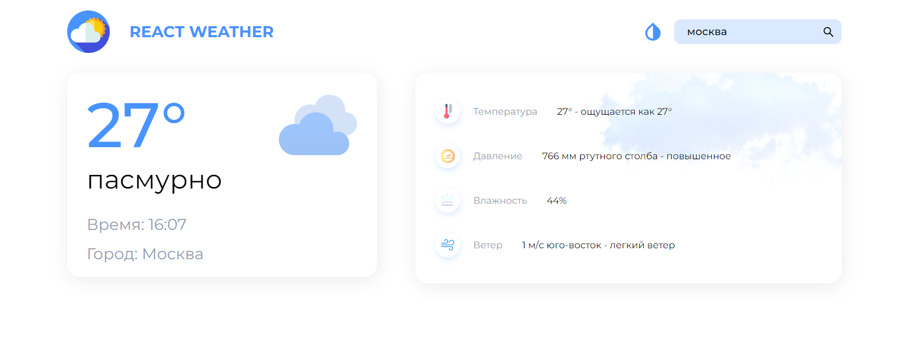
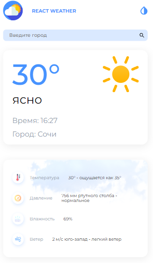
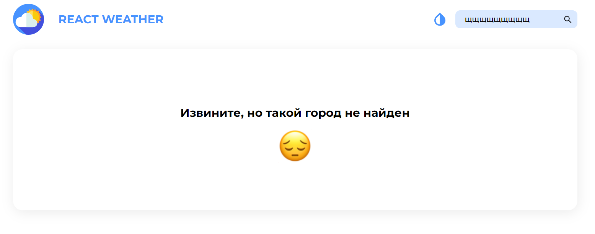
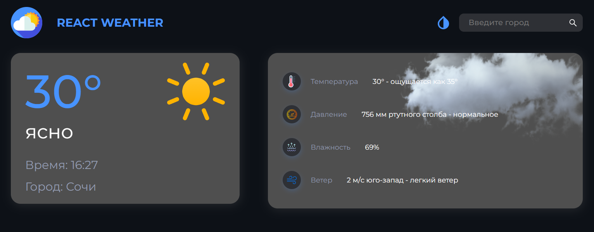

# React Weather

https://weather-redux-app.vercel.app/ - ссылка на проект

## Используемые технологии
React, TypeScript, Redux, Redux-Thunk, Axios, SASS

## Описание проекта
* Это веб-приложение позволяет узнать текущую погоду в любом городе мира. Нужно всего лишь набрать название населенного пункта в поиске. 

* Приложение полностью адаптивно: корректно отображается на всех типах устройств (ПК, планшет, смартфон)

* Приложение не ломается, если ввести некорректное значение. Например, если ввести неправильное название города, то появится сообщение об ошибке.

* Также была сделана тёмная тема, которая сохраняется даже после перезагрузки страницы


## Инструкция по запуску проекта

1. Сначала склонируйте проект себе на локальное устройство. Например, это можно сделать с помощью HTTPS. Команда для клонирования проекта: 
```
git clone https://github.com/Emil-Ka/weather-redux-app.git
```
2. Убедитесь, что у вас установлена NodeJS. Сайт для скачивания: https://nodejs.org/ru/ Чтобы проверить, установлен ли NodeJS, можно воспользоваться командой:
```
node -v
```
3. Установите все зависимости с помощью команды:
```
npm ci
```
4. Запустите проект с помощью команды:
```
npm start
```